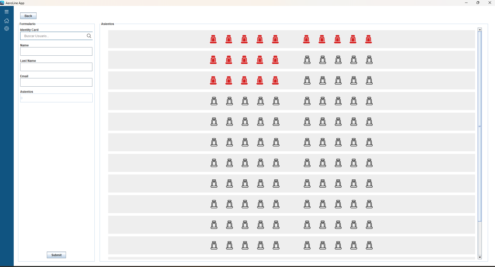

# Aero Line App

Demo application, simulates a purchase gateway where you can buy airline tickets with their seats.

## pre-requisites

Have a MySQL database with a user: 
* user: root
* pass: admin

or use docker
``` cmd
$ docker-compose up -d --build
```

## Dependencies
* maven
* java.sql

## Imgs

